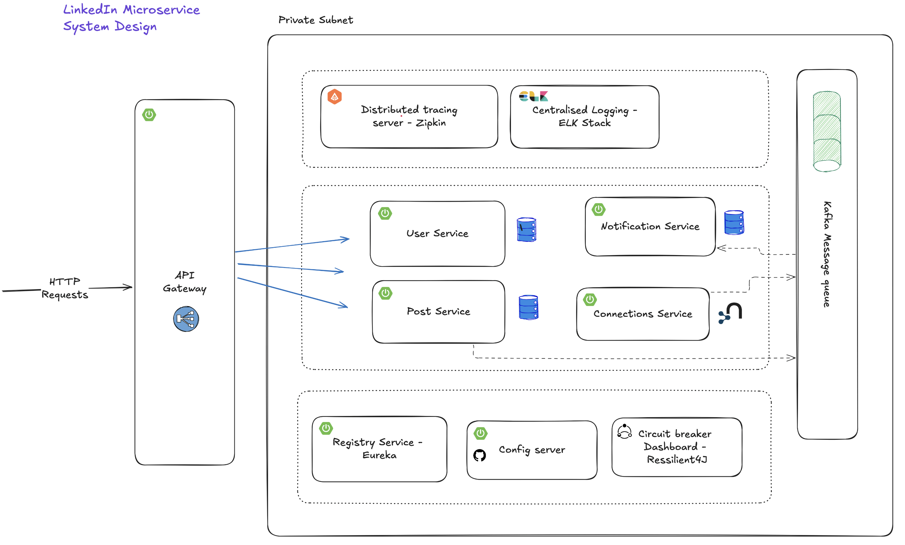
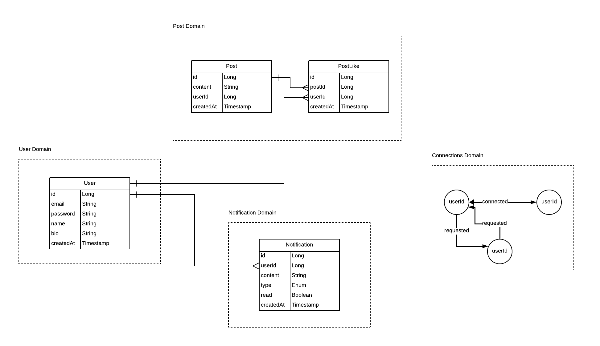

# 🚀 Skillora — Professional Networking Platform (Microservices)

> **Skillora** is a LinkedIn-inspired professional networking platform built using **Spring Boot Microservices**, designed for scalability, resilience, and real-time user interactions. It demonstrates production-level backend engineering practices such as API Gateway routing, service discovery, event-driven communication with Kafka, distributed tracing, centralized logging, and fault tolerance.

---

## ✨ Key Highlights

* 🧩 **Microservices Architecture** with clear domain boundaries
* 🌐 **API Gateway** for centralized routing & security
* 🔍 **Service Discovery (Eureka)** for dynamic service registration
* ⚡ **Event‑Driven Communication** using Apache Kafka
* 🛡 **Resilience4j** for circuit breaking & fault tolerance
* 📊 **Distributed Tracing (Zipkin)** for request flow analysis
* 🪵 **Centralized Logging (ELK Stack)** for observability
* 🗄 **Database per Service** for loose coupling & scalability

---

## 🏗️ System Architecture

> High‑level architecture of Skillora microservices ecosystem



**Flow Overview**:

1. Client sends HTTP requests to **API Gateway**
2. Gateway routes requests to appropriate microservices
3. Services communicate synchronously (REST) or asynchronously (Kafka)
4. Logs & traces are collected via **ELK** and **Zipkin**

---

## 🧠 Core Microservices

### 🔐 User Service

Handles authentication and user profile management.

**Responsibilities**:

* User registration & login
* JWT-based authentication
* Profile management

**APIs**:

```http
POST   /auth/signup
POST   /auth/login
GET    /users/{userId}/profile
PUT    /users/{userId}/profile
```

---

### 📝 Post Service

Manages user posts and interactions.

**Responsibilities**:

* Create and fetch posts
* Like posts
* Fetch user-specific posts

**APIs**:

```http
POST   /posts
GET    /posts/{postId}
POST   /posts/{postId}/like
GET    /users/{userId}/posts
```

---

### 🤝 Connections Service

Handles professional connections between users.

**Responsibilities**:

* Send & accept connection requests
* Fetch nth‑degree connections

**APIs**:

```http
POST   /connections/request
POST   /connections/accept
GET    /connections/{userId}/{degree}
```

---

### 🔔 Notification Service

Delivers real-time notifications using Kafka.

**Responsibilities**:

* Consume events (likes, connections)
* Store notifications
* Mark notifications as read

**APIs**:

```http
GET    /notifications/{userId}
POST   /notifications/mark-as-read
```

---

## 🗂️ Database Design

Each service owns its database to maintain **loose coupling**.



**Highlights**:

* User ↔ Post (1:N)
* Post ↔ Like (1:N)
* User ↔ Notification (1:N)
* Connections modeled as graph relationships

---

## 📡 Event‑Driven Architecture (Kafka)

Kafka is used for asynchronous communication:

* 📩 **Post Liked Event** → Notification Service
* 🤝 **Connection Accepted Event** → Notification Service

This ensures:

* High scalability
* Loose coupling between services
* Better system resilience

---

## 🧰 Tech Stack

| Category          | Technologies              |
| ----------------- | ------------------------- |
| Language          | Java                      |
| Framework         | Spring Boot, Spring Cloud |
| API Gateway       | Spring Cloud Gateway      |
| Service Discovery | Eureka                    |
| Messaging         | Apache Kafka              |
| Resilience        | Resilience4j              |
| Tracing           | Zipkin                    |
| Logging           | ELK Stack                 |
| Database          | PostgreSQL / MySQL        |
| Build Tool        | Maven                     |

---

## 📁 Project Structure

```text
Skillora/
│── api-gateway/
│── discovery-server/
│── user-service/
│── posts-service/
│── connections-service/
│── notification-service/
│── README.md
│── System_Design.png
│── DataBase_Design.png
│── APIs.png
```

---

## 🎯 What This Project Demonstrates

* Real‑world **backend system design**
* Strong understanding of **microservices patterns**
* Experience with **observability & resilience** tools
* Clean API design & domain separation

---

## 🚧 Future Enhancements

* Centralized authentication at API Gateway
* Role‑based access control (RBAC)
* Caching with Redis
* Full‑text search with Elasticsearch
* Frontend integration

---

## 👨‍💻 Author

**Shaik Nayeem Basha**
Backend Developer | Java | Spring Boot | Microservices

📌 *This project is built for learning, showcasing system design skills, and interview readiness.*

